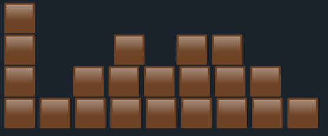
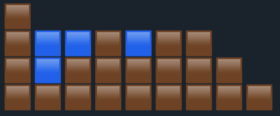

Весь код нужно писать в специальном редакторе, с подстветкой синтаксиса, удобным форматированием, но без автодополнения, и без возможности скомпилировать код и запустить. То есть все решения просто обсуждались с интервьюером. Никакой код мы не запускали и не проверяли, что он работает.

# Первое интервью
1. Дана строка состоящая из заглавных латинских букв: AAABBCCDDDD
   Нужно сжать ее в строку: 3A2B2C4D

2. Расскажите про `Iterator`. Какой контракт у `Iterator`-а.
   Что будет, если бесконечно вызывать метод `hasNext()`
   Что будет, если бесконечер вызывать метод `next()` (не проверяя `hasNext()`)

   Релизуйте класс "Фильтрующий итератор", который в конструкторе принимает коллекцию и предикат, и возвращает только те элементы, которые удовлетворяют предикату

```java
public class FilteringIterator<T> implements Iterator<T> {
		
	public FileringIterator(Collection<T> container, Predicate<T> condition) {
		// TODO
	}
	
	public T next() {
		// TODO
	}
	
	public T hasNext() {
		// TODO
	}
	
	// you don't have to implement other methods
}
```


3. Даны следующие классы таблицы и строк таблицы (отсылка к таблицам и строкам из БД):
```java
class Table {
	Set<Row> getRows(); // implementation is implied
}

class Row {
	long pk;
	Row merge(Row row); // implementation is implied
}
```

Есть возможность дописывать какие угодно методы в классы `Table` и `Row` без необходимости реализации, но чтобы по сигнатуре было ясно, что делает метод,
а также какие угодно поля.

Необходимо реализовать процедуру inner join по первичному ключу.

Доп вопросы.
Все вопросы задаются последовательно.
Поэтому не разворачивай следующий вопрос, пока не ответишь на предыдущий.
Следующие вопросы могут быть подсказками
<ul>
	<li>
		<details>
			<summary>Вопрос 1</summary>
			Оцените сложность вашего алгоритма.
		</details>
	</li>
	<li>
		<details>
			<summary>Вопрос 2</summary>
			Можно ли как-то ускорить алгоритм?
		</details>
	</li>
	<li>
		<details>
			<summary>Вопрос 3</summary>
			Как можно реализовать поддержку индексов в этой структуре классов?
		</details>
	</li>
	<li>
		<details>
			<summary>Вопрос 4</summary>
			Допустим есть REST endpoint, который позволяет по ключу получить строку из таблицы:<br>
		   <code>GET :8080/row/{pk}</code><br><br>
           И REST endpoint, который позволяет добавлять строку в таблицу<br>
           <code>POST :8080/row --data ...</code><br><br>
           Эндпоинты вызываются параллельно множеством пользователей.<br>
		   Нагрузка умеренная.<br><br>
		   Как можно модифицировать ваш код для реализации индекса, чтобы он поддерживал параллельное обновление?<br>
		</details>
	</li>
</ul>


# Второе интервью

### Вопрос 1
Дан массив целых чисел.  
Нужно реализовать процедуру shuffle, которая перемешивает массив.
```java
public void shuffle(int[] array) {
	// TODO
}

```
- Причем процедура должна перемещать каждый элемент на любое место в массиве с равной вероятностью.
- Алгоритм должен работать in-place, то есть пространственная сложность O(1)
- Алгоритм должен работать за время O(n)

Докажите, что соблюдается условие равновероятности перемещения каждого элемента на любое место.

### Вопрос 2

Расскажите, зачем нужны volatile, какие гарантии позволяют получить volatile перменные.

Объясние, что происходит в этом примере:
```java
volatile bolean ready = false;
Map<Integer, String> map = new HashMap<>();

// Thread 1
while (!ready) {
	// backoff
}

map.get(1);
map.get(2);

// Thread 2
map.set(1, "one");
map.set(2, "two");
ready = true;
```

- Зачем тут нужна volatile переменная?
- Что может произойти, если убрать модификатор volatile?

### Вопрос 3: Про механизмы блокировок в java

- Что такое ReentrantLock? Почему он называется Reentrant?
 <ul>
	<li>
		<details>
			<summary>Вопрос 1</summary>
			Является ли блокировка, которая берется с блоке synchronized reentrant блокировкой? 
		</details>
	</li>
	<li>
		<details>
			<summary>Вопрос 2</summary>
 			 Зачем придумали ReentrantLock, если есть synchronized блоки?
		</details>
	</li>
</ul>

Посмотрите на следующий блок кода.  
Функция `Counter#increment()` может вызываться из нескольких потоков одновременно.

Оцените значение, которое вернет `Counter#get()` в конце.  
Объясните такой результат.

```java
class Counter {
    private int counter;

    public void increment() {
        counter++;
    }

    public int get() {
        return counter;
    }
}

public class Main {

    public static void main(String[] args) throws InterruptedException {
        var latch = new CountDownLatch(1_000_000);
        var tp = new ForkJoinPool();
        var counter = new Counter();

        for (int i = 0; i < 1_000_000; i++) {
            tp.submit(() -> {
                counter.inc();
                latch.countDown();
            });
        }

        latch.await();
        System.out.println(counter.get());

        tp.shutdownNow();
    }
}
```
<ul>
	<li>
		<details>
			<summary>Вопрос 1</summary>
			Как исправить проблему
		</details>
	</li>
	<li>
		<details>
			<summary>Вопрос 2</summary>
			Как устроен AtomicInteger
		</details>
	</li>
	<li>
		<details>
			<summary>Вопрос 3</summary>
			Можно ли реализовать CompareAndSwap в java?
		</details>
	</li>
</ul>

Какие примитивы синхронизации вы знаете?

<ul>
	<li>
		<details>
			<summary>Вопрос 1</summary>
			Расскажите, для чего нужен семафор?  
		</details>
	</li>
	<li>
		<details>
			<summary>Вопрос 2</summary>
 			Семафор используется для того, чтобы ограничить кол-во потоков, которые одновременно могут находиться в критическое секции.<br>
			У семафора есть два метода: `aquire()` и `release()`;<br>
			Представьте, что какой-то из потоков, которые используют семафор, вызовет `release()` без `aquire()`. Нарушит ли это гарантию, которую дает семафор? 
		</details>
	</li>
</ul>

### Вопрос 4

Представьте что вы смотрите на рельеф в профиль:


Этот рельеф описывается массивом высот: [4, 1, 2, 3, 2, 3, 3, 2, 1]  
Высота первого элемент - 4, второго - 2, и так далее.

Представьте, что пошел дождь, и все ямы заполнились водой.



Нужно написать алгоритм, который принимает на вход массив высот,  
и вычисляет сколько воды будет в ямах после дождя.  
Вода заполняет только ямы! Если ямы нет, то вода просто стегает с поверхности.  


# Третье интервью

### Задача
Мы проектируем инстаграмм, но с ограниченной функциональностью. 

У пользователей есть друзья.  
У пользователей есть лента, которая содержит 10 самых последних загруженных фотографий среди всех друзей.  

Всего пользователей в системе 2.5 млрд.  
Всего данных сейчас храниться 5Пб. Каждый день кол-во данных (фотографий) увеличивается на 5Тб.

Нужно спроектировать архитектуру данной системы с учетом кол-ва пользователей и растущей нагрузки.

----------

Дальше мне нужно было задавать уточняющие вопросы интервьюеру, чтобы выяснить функциональные требования, на которых нужно сосредоточиться и нефункциональные требования.

Из Функциональых требований самое важное это:
 - Возможность добавления фотографий
 - Возможность просматривать ленту, в которой показываются максимум 10 фотографий фотографии твоих друзей, при этом фотографии в ленте отсортированы по времени в порядке DESC.

Дальше я думал, что из Нефункциональных требований стоит уточнить у интервьюера. Я задал такой вопрос:
- Насколько актуальной должна быть информация в ленте? В том смысле, если какой-то друг опубликовал фотографию, как скоро должна она появиться в моей ленте?

Интервьюер адресовал этот вопрос мне с формулировкой:  
А как ты бы сам ответил на этот вопрос?  

Спросил, знаком ли я с __CAP теоремой__.  
Спросил, какого класса будет та система, которую мы строим: CP или AP.

Дальше мы уже начали в [draw.io](https://draw.io) рисовать схему этой системы.  

К сожалению, самой схемы у меня не осталось.  
Если нужно будет, я смогу восстановить.  

